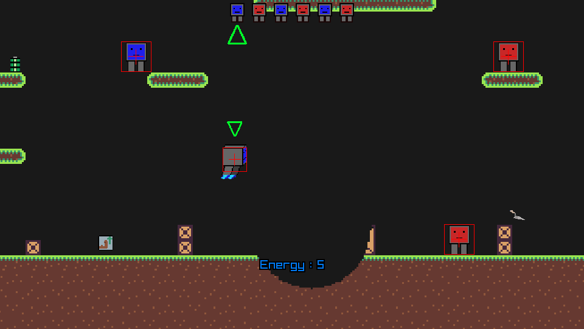

 


-----------------------------------

## Running the game

The game was tested using python 3.11 and 3.12 on windows and linux.

### From pycharm
1) Open the directory containing main.py in pycharm
2) Setup a venv
3) Using the "python package" tab, search and install "raylib"
4) Execute main.py

### From shell (or other IDE)
```shell
# Enter the directory containing main.py, then type
pip install raylib    # One time
python ./main.py
```

### Screenshot
